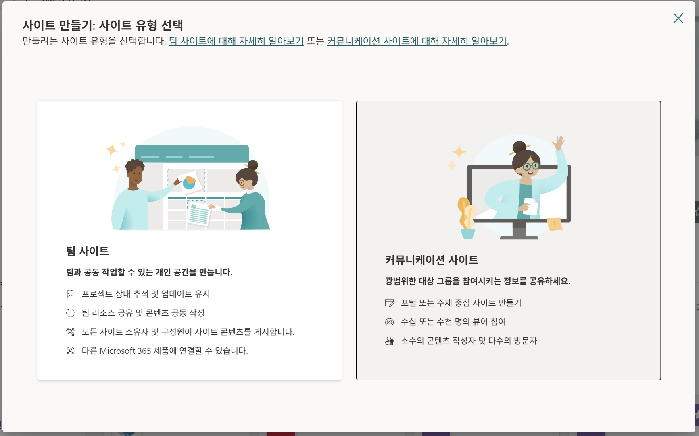
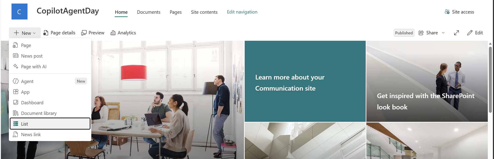
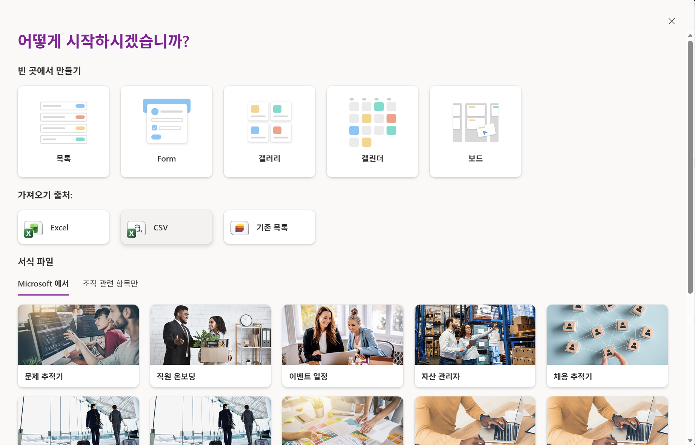
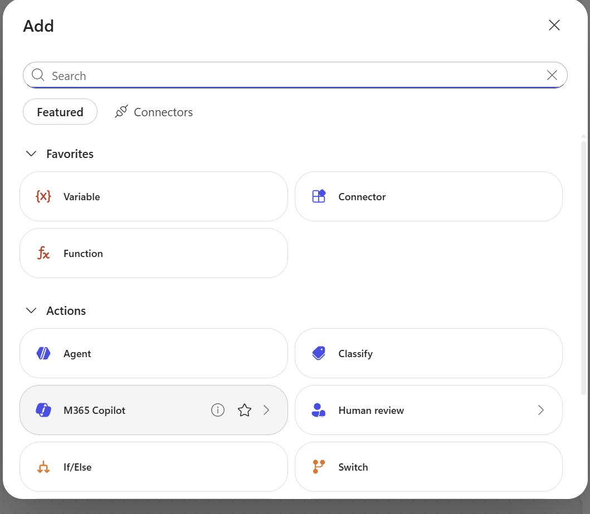
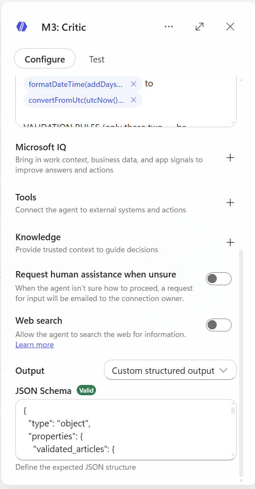
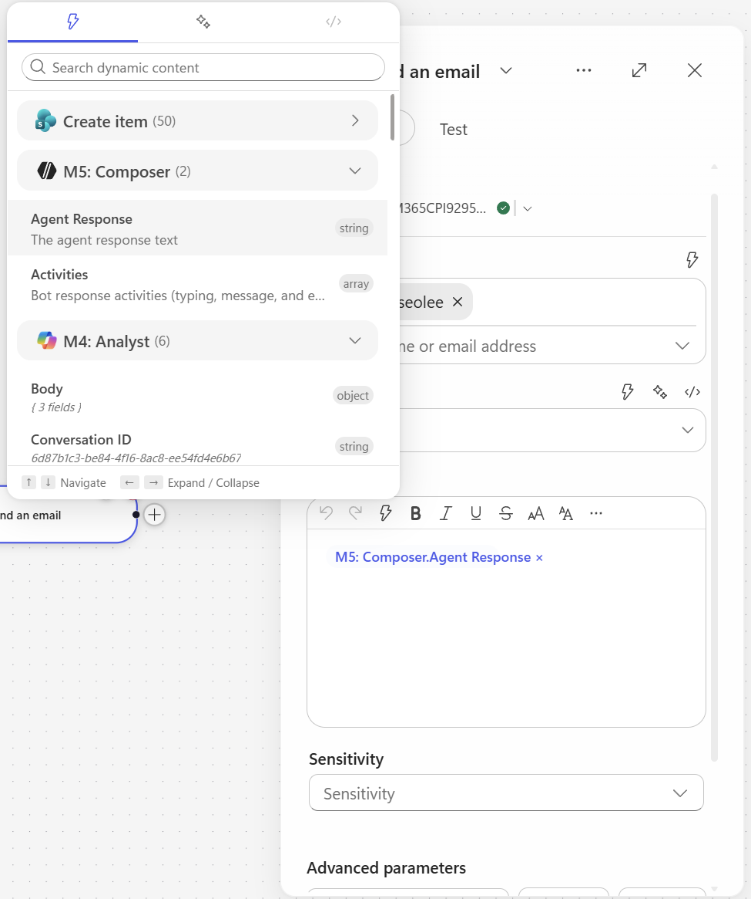
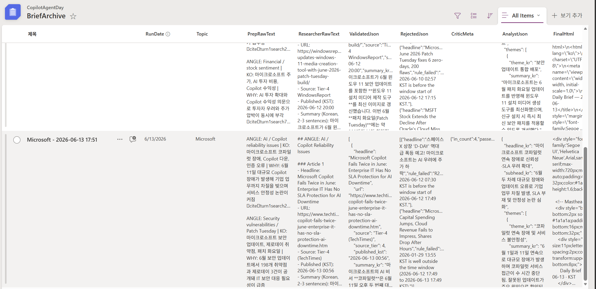
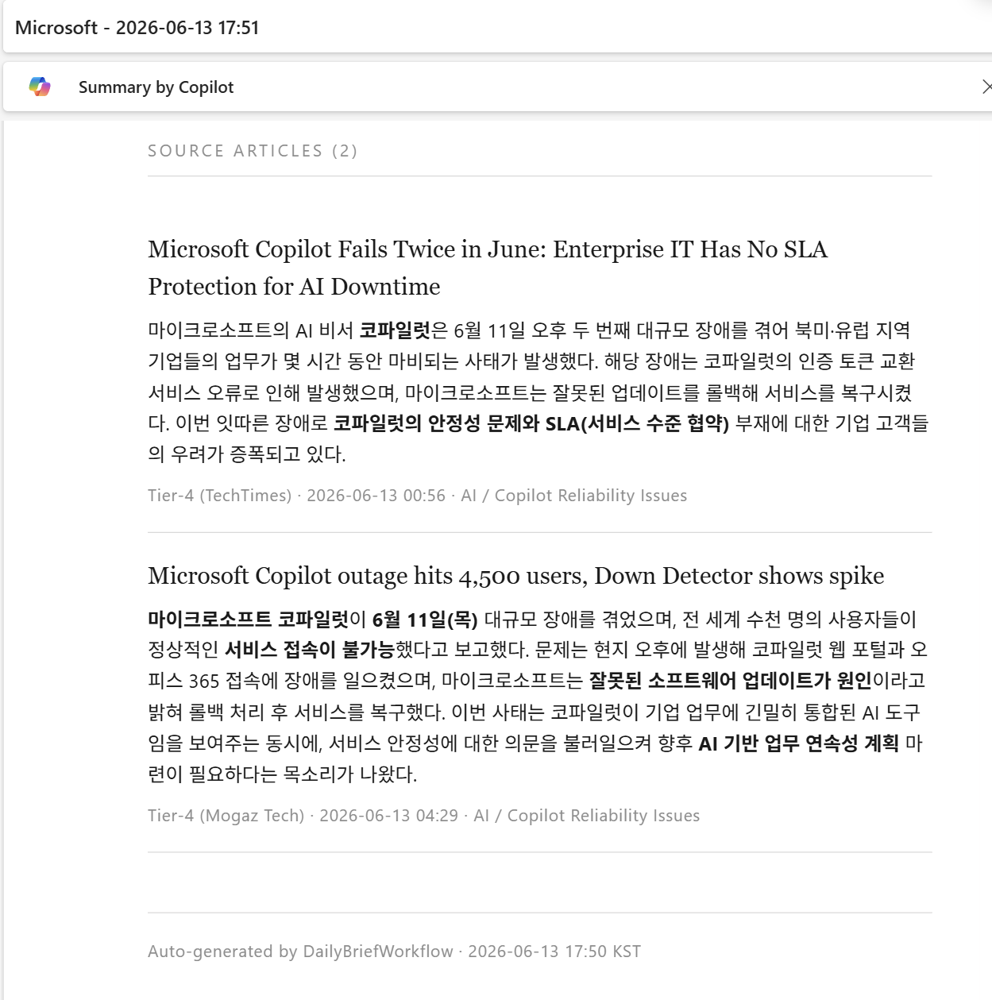

# Daily Brief Workflow — Hands-on Guide

> Copilot Studio의 신규 기능(Workflow + Custom Structured Output + Researcher node)을 활용해, 매일 특정 회사에 대한 뉴스 브리프를 자동 생성하고 메일로 발송하는 워크플로우를 30분 안에 구축합니다.

---

## 목차

1. [개요 및 아키텍처](#1-개요-및-아키텍처)
2. [사전 준비](#2-사전-준비)
3. [SharePoint List 생성](#3-sharepoint-list-생성)
4. [Workflow 생성 — 8개 노드](#4-workflow-생성--8개-노드)
   - 4.1 [Trigger: Manual](#41-trigger-manual)
   - 4.2 [Prep — M365 Copilot 노드](#42-prep--m365-copilot-노드)
   - 4.3 [Researcher 노드](#43-researcher-노드)
   - 4.4 [Critic — Agent 노드](#44-critic--agent-노드)
   - 4.5 [Analyst — Agent 노드](#45-analyst--agent-노드)
   - 4.6 [Composer — Agent 노드](#46-composer--agent-노드)
   - 4.7 [SharePoint — Create item](#47-sharepoint--create-item)
   - 4.8 [Send email V2](#48-send-email-v2)
5. [테스트 및 실행](#5-테스트-및-실행)

---

## 1. 개요 및 아키텍처

### 1.1 무엇을 만드나

매일 (또는 수동 trigger 시) 다음 흐름을 자동 실행하는 Copilot Studio Workflow:

1. **Prep**: 회사명을 받아 오늘 주목할 2-3가지 각도(angle)와 키워드 추출
2. **Researcher**: 각도별로 실제 뉴스 6-8건을 인터넷에서 조사
3. **Critic**: URL/날짜 검증으로 신뢰할 수 있는 기사만 필터링
4. **Analyst**: 검증된 기사를 테마/KPI/인사이트로 분석
5. **Composer**: 메일용 HTML 본문 생성
6. **SharePoint 저장 + 메일 발송**

### 1.2 아키텍처 다이어그램


```
[Trigger: Manual — researchTopic 입력]
       ↓
[Prep — M365 Copilot 노드]      ← 가벼움 (5-10초)
       ↓
[Researcher — M365 Copilot 노드] ← 깊은 웹 리서치 (1-6분, Prefer async)
       ↓
[Critic — Agent 노드]            ← URL/날짜 검증, Structured Output
       ↓
[Analyst — Agent 노드]           ← 테마/KPI 분석, Structured Output
       ↓
[Composer — Agent 노드]          ← HTML 메일 본문
       ↓
[SharePoint Create item]        ← BriefArchive 저장
       ↓
[Send email V2]                 ← HTML 메일 발송
```


## 2. 사전 준비

### 2.1 필요한 라이선스 / 권한

- Microsoft 365 Copilot 라이선스 (Researcher 노드 사용)
- Copilot Studio 액세스
- SharePoint 사이트 (List 생성 권한)
- Outlook 메일 발송 권한

### 2.2 미리 결정할 것

- **대상 회사명** (예: `Microsoft`)
- **SharePoint 사이트 URL**
- **메일 수신자 주소**

---

## 3. SharePoint List 생성

### 3.1 List 이름

```
BriefArchive
```

### 3.2 컬럼 정의

| 컬럼 이름 | 타입 | 설명 |
|---|---|---|
| `Title` | Single line of text | 자동 ("Microsoft - 2026-06-13 17:00") |
| `RunDate` | Date and Time | 실행 시각 (UTC) |
| `Topic` | Single line of text | 대상 회사명 |
| `PrepRawText` | Multiple lines of text | Prep 원본 출력 |
| `ResearcherRawText` | Multiple lines of text | Researcher 원본 출력 |
| `ValidatedJson` | Multiple lines of text | Critic 전체 JSON (validated + rejected + meta) |
| `AnalystJson` | Multiple lines of text | Analyst 전체 JSON |
| `FinalHtml` | Multiple lines of text | Composer HTML 본문 |
| `Status` | Text | 옵션: `ok`, `low_yield`, `failed` |

> **TIP**: 이떄 미리 준비된 csv파일을 import하여 빠르게 Sharepoint list를 생성한다.

### 3.3 List 생성 단계 안내

1. 사이트 먼저 생성





2. 리스트 생성 (가져오기 출처: CSV)



---

## 4. Workflow 생성 — 8개 노드

Copilot Studio → Flows (또는 Workflows) → **+ New Flow**


---

### 4.1 Trigger: Manual

**노드 추가**: `Manually trigger a flow` 선택.

**Input parameter**:
| 필드 | 값 |
|---|---|
| Name | `researchTopic` |
| Type | `String` |
| Description | `Company to research` |

 


### 4.2 Prep — M365 Copilot 노드



**노드 추가**: `M365 Copilot` (또는 "Use Microsoft 365 Copilot")

**노드 이름**: `Prep` (오른쪽 상단 ··· → Rename)


**Prompt** :

```
You are a news scout. Your job is to identify the 2 most important 
angles to investigate about "
" 
in the last 24 hours.

CURRENT TIME (KST): 
TIME WINDOW: last 24 hours from now (KST)

ANGLES TO CONSIDER (pick 2 most likely to have real news today):
- Product launches / updates
- Financial / earnings / stock-moving news
- AI / model / Copilot announcements
- Partnerships / acquisitions / deals
- Executive moves / leadership
- Regulatory / legal / antitrust
- Major customer wins or losses

OUTPUT (plain text, no markdown headers, no JSON):
For each angle, write ONE line in this exact format:
ANGLE: <english angle name> | KO: <한국어 검색 키워드 2-4개, 쉼표구분> | WHY: <왜 오늘 봐야 하는지 한 문장>

Example:
ANGLE: AI announcements | KO: 마이크로소프트 AI, Copilot 신기능, GPT 통합 | WHY: 최근 Build 컨퍼런스 직후라 후속 발표 가능성 높음
ANGLE: Partnerships | KO: 마이크로소프트 파트너십, 클라우드 계약 | WHY: 분기말 대형 계약 발표 시즌

Return 3-5 lines only. No preamble. No closing remark.

```


> 이때 prefer async는 키는 것을 추천

---

### 4.3 Researcher 노드

**노드 추가**: `M365 Copilot Node' 
- 이후 Agent 속성에서 Researcher 선택

**노드 이름**: `Researcher`

**설정**:

| 옵션 | 값 |
|---|---|
| Prefer Async | **ON** (필수) |
| Agent | Researcher |

>Prefer async: 액션이 2분 이상 걸릴 때 켜는 옵션. 토글 OFF면 ~120초에서 timeout, ON이면 백그라운드 polling으로 끝까지 기다림.

→ Researcher 노드는 무조건 ON (deep search가 30초~6분), 

**Prompt** (본인이 직접 복붙):

```
You are a news researcher operating in autonomous mode.
Do NOT ask clarifying questions. Execute and return results.

TOPIC:  


ANGLES TO INVESTIGATE (from Prep):


TIME WINDOW (HARD REQUIREMENT, KST):
  From: 
  
  To:   
  
  Treat "today" / "yesterday" as KST.

TASK:
 For each angle, find 2-3 articles. (using keywords of each angle)
Total target: 6-8 articles.
STOP searching once you have 6-8 quality articles. Do NOT exceed.


PREFERRED SOURCES (but include others if relevant):  
- Korean: 전자신문, ZDNet Korea, 디지털타임스, 디지털데일리, 블로터,     한국경제 IT, 매일경제 IT, 조선비즈  
- Global: Reuters, Bloomberg, AP, Financial Times, WSJ, CNBC,     The Verge, Ars Technica, TechCrunch  
- Official company websites


OUTPUT FORMAT (markdown, one article per block):

## ANGLE: <angle name>

### Article 1
- Headline: <original headline>
- URL: <full https URL>
- Source: <Tier-X source name>
- Published (KST): YYYY-MM-DD HH:mm
- Summary (Korean, 2-3 sentences): <한국어 요약>
- Key facts: <numbers/dates/names if any>

### Article 2
...

(repeat per angle)

SELF-CHECK BEFORE OUTPUT:
1. Every article has a full https:// URL? If not, remove it.
2. Every Published date is within the time window? If not, remove it.
3. Source is Tier 1-4? If not, remove it.
4. Removed all opinion/rumor/marketing? 
5. No duplicate URLs?

If fewer than 3 qualified articles total, output only:
NO_RESULTS

Begin output immediately. No preamble.


```


### 4.4 Critic — Agent 노드

**노드 추가**: `Agent` (인라인 Agent 노드)

**노드 이름**: `Critic`

**Prefer Async**: `Off`

#### 4.4.1 Instructions

```
You are a news validation critic. You DO NOT add or rewrite information.
You only filter and structure.

INPUT (from Researcher):
{outputs('m365Copilot-7998626b-2486-41f1-b762-a55d6711a431')?['body/response']}

CURRENT TIME (KST): {convertFromUtc(utcNow(), 'Korea Standard Time', 'yyyy-MM-dd HH:mm')}
TIME WINDOW (KST): from {formatDateTime(addDays(convertFromUtc(utcNow(), 'Korea Standard Time'), -1), 'yyyy-MM-dd HH:mm')} to {convertFromUtc(utcNow(), 'Korea Standard Time', 'yyyy-MM-dd HH:mm')}

VALIDATION RULES (only these two — be LENIENT, default to passing):
  R1. URL exists and starts with http:// or https://
  R2. Published date is within the TIME WINDOW above (KST).
If published date is missing or ambiguous, PASS the article (do not reject).
Only reject if you can clearly confirm the date is outside the window.

DO NOT REJECT for any other reason. Specifically:
Do not judge source quality, opinion vs news, duplicates, or relevance.
Do not reject for "looks like a blog" or "couldn't verify source tier".
When in doubt → PASS.

ACTION:
Passing articles → "validated_articles" (keep all fields from Researcher; 
    if a field is missing, use empty string "")
Failing articles → "rejected" with rule_failed (R1 or R2) + short reason
Compute _meta counts

CONFIDENCE SCORE (_meta.confidence, 0.0-1.0):
  passed / in_count
If passed == 0 → confidence = 0
If passed >= 5 → set warning = "" (empty)
If passed < 2 → set warning = "low_yield"


Return JSON only matching the schema. No commentary.​‌


```

#### 4.4.2 Output → Structured output (JSON Schema)



UI 상단 `Output` 드롭다운 → **Structured output** 선택 → JSON schema 붙여넣기:

```json
{
  "type": "object",
  "properties": {
    "validated_articles": {
      "type": "array",
      "items": {
        "type": "object",
        "properties": {
          "headline": {"type": "string"},
          "url": {"type": "string"},
          "source": {"type": "string"},
          "source_tier": {"type": "integer"},
          "published_kst": {"type": "string"},
          "summary_kr": {"type": "string"},
          "key_facts": {"type": "string"},
          "angle": {"type": "string"}
        },
        "required": ["headline", "url", "source", "source_tier", "published_kst", "summary_kr", "key_facts", "angle"],
        "additionalProperties": false
      }
    },
    "rejected": {
      "type": "array",
      "items": {
        "type": "object",
        "properties": {
          "headline": {"type": "string"},
          "rule_failed": {"type": "string"},
          "reason": {"type": "string"}
        },
        "required": ["headline", "rule_failed", "reason"],
        "additionalProperties": false
      }
    },
    "meta": {
      "type": "object",
      "properties": {
        "in_count": {"type": "integer"},
        "passed": {"type": "integer"},
        "rejected_count": {"type": "integer"},
        "confidence": {"type": "number"},
        "warning": {"type": "string"}
      },
      "required": ["in_count", "passed", "rejected_count", "confidence", "warning"],
      "additionalProperties": false
    }
  },
  "required": ["validated_articles", "rejected", "meta"],
  "additionalProperties": false
}

```


---

### 4.5 Analyst — Agent 노드 (Agent: Analyst)


**노드 추가**: `M365 Copilot`

**노드 이름**: `Analyst`

**prefer Async**: `On`

**Agent**: `Analyst`

#### 4.5.1 Instructions

```
You are a senior business analyst. Convert validated news articles 
into a structured executive brief.

INPUT (validated articles JSON):


TOPIC: 

DATE (KST): 


TASK:
1. Group articles into 2-4 themes (e.g., "AI 전략", "재무 실적", 
   "파트너십 확대"). Each theme cites which article URLs support it.
2. Extract KPI cards: any specific numbers mentioned 
   (revenue, growth %, user counts, deal sizes, dates).
3. Generate ONE cross-cutting insight (한국어, 2-3 sentences) 
   — what these news collectively signal about the company today.
4. If numbers allow, suggest one simple chart 
   (bar/line/none). Otherwise chart_type = "none".

STRICT RULES (self-check before output):
  S1. EVERY fact in your output must be present in the input 
      validated_articles. No fabrication.
  S2. EVERY KPI must cite source_url from input.
  S3. NO speculation. If unclear, omit.
  S4. If input is empty or null, return empty themes/kpi_cards and 
      headline_kr = "오늘 검증된 뉴스가 부족합니다."
  S5. All Korean text. Concise. Executive tone.

Return JSON only matching the schema.

{
  "type": "object",
  "properties": {
    "headline_kr": {"type": "string", "maxLength": 100},
    "subhead_kr": {"type": "string", "maxLength": 200},
    "themes": {
      "type": "array",
      "items": {
        "type": "object",
        "properties": {
          "theme_kr": {"type": "string"},
          "summary_kr": {"type": "string", "maxLength": 300},
          "supporting_urls": {"type": "array", "items": {"type": "string"}}
        },
        "required": ["theme_kr", "summary_kr", "supporting_urls"]
      }
    },
    "kpi_cards": {
      "type": "array",
      "items": {
        "type": "object",
        "properties": {
          "label_kr": {"type": "string"},
          "value": {"type": "string"},
          "context_kr": {"type": "string"},
          "source_url": {"type": "string"}
        },
        "required": ["label_kr", "value", "source_url"]
      }
    },
    "chart": {
      "type": "object",
      "properties": {
        "chart_type": {"type": "string", "enum": ["bar", "line", "none"]},
        "title_kr": {"type": "string"},
        "data_points": {
          "type": "array",
          "items": {
            "type": "object",
            "properties": {
              "label": {"type": "string"},
              "value": {"type": "number"}
            }
          }
        }
      }
    },
    "cross_cutting_insight_kr": {"type": "string", "maxLength": 400}
  },
  "required": ["headline_kr", "themes", "cross_cutting_insight_kr"]
}


```


### 4.6 Composer — Agent 노드

**노드 추가**: `Agent`

**노드 이름**: `Composer`

#### 4.6.1 Instructions

```
You are a presentation-layer composer. Your job is ONLY to render the 
input data into a premium consulting-report-style HTML. You DO NOT 
summarize, shorten, paraphrase, or omit any content.

INPUT 1 — Analyst brief (전체 JSON):
{outputs('m365Copilot-d649e3c3-fc5a-4515-8c68-d8799d3be674')?['body/response']}

INPUT 2 — Validated articles (전체 JSON 배열):
{body('agent-38b44900-e17b-41bd-a4bb-46c7be9ebdaf')?['structuredOutput/validated_articles']}

TOPIC: {triggerBody()?['text']}
DATE (KST): {convertFromUtc(utcNow(), 'Korea Standard Time', 'yyyy-MM-dd')}

══════════════════════════════════════════════════════
CONTENT RULES (CRITICAL — DO NOT MODIFY INPUT TEXT)
══════════════════════════════════════════════════════
Render EVERY field from INPUT 1: headline_kr, subhead_kr, ALL themes, 
  ALL kpi_cards, cross_cutting_insight_kr.
Render EVERY article from INPUT 2 (do not cap at any number).
Use the EXACT text from inputs. No paraphrasing. No shortening.
No "..." truncation. No summarizing the summaries.
If a field is empty/null, just skip that element (don't write "N/A").

══════════════════════════════════════════════════════
OUTPUT FORMAT RULES (CRITICAL)
══════════════════════════════════════════════════════
Output ONLY raw HTML.
Start with: <div
End with: </div>
NO JSON. NO markdown code fences. NO commentary.
Pure HTML that can be pasted directly into email body.

══════════════════════════════════════════════════════
DESIGN SYSTEM — McKinsey / BCG consulting report aesthetic
══════════════════════════════════════════════════════
Color palette:
Background: #ffffff
Primary text: #1a1a1a (near black)
Secondary text: #595959
Subtle text / meta: #8c8c8c
Accent (one color only): #003a70 (deep navy)
Hairline rule: #d9d9d9
Highlight bg: #f5f5f0 (warm off-white for insight box)

Typography:
Headings: 'Georgia', 'Cambria', serif (consulting feel)
Body: 'Segoe UI', 'Helvetica Neue', Arial, sans-serif
Article meta: 11-12px, color:#8c8c8c
Generous line-height: 1.6
Letter-spacing on H1: 0.5px

Spacing:
Container max-width: 720px, centered
Section spacing: 40px vertical
Generous padding inside containers: 24-32px

Visual touches (subtle):
Thin (1px) hairline rules under section headings
Small uppercase section labels (letter-spacing:2px, font-size:11px)
Numbered sections (01. / 02. / 03.) for themes
KPI numbers: large (32px), serif, color:#003a70
No emoji. No drop shadows. No gradients. No rounded corners > 2px.
No buttons. No CTAs. Just clean editorial layout.

══════════════════════════════════════════════════════
HTML STRUCTURE (follow this skeleton, render ALL input data)
══════════════════════════════════════════════════════
<div style="font-family:'Segoe UI','Helvetica Neue',Arial,sans-serif;
            max-width:720px;margin:0 auto;padding:40px 32px;
            color:#1a1a1a;line-height:1.6;background:#ffffff;">

  <!-- Masthead -->
  <div style="border-bottom:2px solid #1a1a1a;padding-bottom:16px;
              margin-bottom:32px;">
    <div style="font-size:11px;letter-spacing:2px;color:#8c8c8c;
                text-transform:uppercase;margin-bottom:8px;">
      Daily Brief · {DATE} · KST
    </div>
    <h1 style="font-family:Georgia,Cambria,serif;font-size:32px;
               font-weight:normal;letter-spacing:0.5px;margin:0;
               color:#1a1a1a;">
      {TOPIC}
    </h1>
  </div>

  <!-- Lead (Analyst headline + subhead) -->
  <div style="margin-bottom:40px;">
    <p style="font-family:Georgia,Cambria,serif;font-size:20px;
              line-height:1.5;margin:0 0 12px 0;color:#1a1a1a;">
      {INPUT1.headline_kr}
    </p>
    <p style="font-size:14px;color:#595959;margin:0;">
      {INPUT1.subhead_kr}
    </p>
  </div>

  <!-- KPI Strip (render ALL kpi_cards from INPUT 1) -->
  <!-- Skip this whole block if kpi_cards is empty -->
  <div style="border-top:1px solid #d9d9d9;border-bottom:1px solid #d9d9d9;
              padding:24px 0;margin-bottom:40px;
              display:flex;gap:32px;flex-wrap:wrap;">
    <!-- For each kpi in INPUT1.kpi_cards: -->
    <div style="flex:1;min-width:160px;">
      <div style="font-size:11px;letter-spacing:1.5px;color:#8c8c8c;
                  text-transform:uppercase;margin-bottom:6px;">
        {kpi.label_kr}
      </div>
      <div style="font-family:Georgia,Cambria,serif;font-size:32px;
                  color:#003a70;line-height:1;margin-bottom:6px;">
        {kpi.value}
      </div>
      <div style="font-size:12px;color:#595959;">
        {kpi.context_kr}
      </div>
    </div>
  </div>

  <!-- Themes (render ALL from INPUT 1, numbered 01./02./03./...) -->
  <div style="margin-bottom:48px;">
    <div style="font-size:11px;letter-spacing:2px;color:#8c8c8c;
                text-transform:uppercase;border-bottom:1px solid #d9d9d9;
                padding-bottom:8px;margin-bottom:24px;">
      Key Themes
    </div>
    <!-- For each theme, render the FULL summary_kr text: -->
    <div style="margin-bottom:32px;">
      <div style="display:flex;gap:16px;align-items:baseline;">
        <span style="font-family:Georgia,Cambria,serif;font-size:14px;
                     color:#003a70;letter-spacing:1px;">01.</span>
        <div style="flex:1;">
          <h3 style="font-family:Georgia,Cambria,serif;font-size:18px;
                     font-weight:normal;margin:0 0 10px 0;color:#1a1a1a;">
            {theme.theme_kr}
          </h3>
          <p style="font-size:14px;color:#1a1a1a;margin:0 0 10px 0;">
            {theme.summary_kr}
          </p>
          <div style="font-size:11px;color:#8c8c8c;">
            Sources: 
            <a href="{theme.supporting_urls[0]}" 
               style="color:#003a70;text-decoration:none;
                      border-bottom:1px solid #003a70;">link</a>
            · <a href="{theme.supporting_urls[1]}" 
                 style="color:#003a70;text-decoration:none;
                        border-bottom:1px solid #003a70;">link</a>
          </div>
        </div>
      </div>
    </div>
    <!-- Repeat for 02., 03., ... using INPUT1.themes -->
  </div>

  <!-- Cross-cutting insight (INPUT 1) -->
  <div style="background:#f5f5f0;padding:32px;margin-bottom:48px;
              border-left:3px solid #003a70;">
    <div style="font-size:11px;letter-spacing:2px;color:#8c8c8c;
                text-transform:uppercase;margin-bottom:12px;">
      Cross-Cutting Insight
    </div>
    <p style="font-family:Georgia,Cambria,serif;font-size:16px;
              line-height:1.7;margin:0;color:#1a1a1a;">
      {INPUT1.cross_cutting_insight_kr}
    </p>
  </div>

  <!-- Source Articles (render ALL articles from INPUT 2) -->
  <div style="margin-bottom:40px;">
    <div style="font-size:11px;letter-spacing:2px;color:#8c8c8c;
                text-transform:uppercase;border-bottom:1px solid #d9d9d9;
                padding-bottom:8px;margin-bottom:20px;">
      Source Articles ({count of INPUT 2})
    </div>
    <!-- For EACH article in INPUT 2 (NO LIMIT): -->
    <div style="padding:16px 0;border-bottom:1px solid #d9d9d9;">
      <a href="{article.url}" 
         style="font-family:Georgia,Cambria,serif;font-size:16px;
                color:#1a1a1a;text-decoration:none;
                display:block;margin-bottom:6px;">
        {article.headline}
      </a>
      <p style="font-size:13px;color:#1a1a1a;margin:6px 0;">
        {article.summary_kr}
      </p>
      <div style="font-size:11px;color:#8c8c8c;letter-spacing:0.5px;">
        {article.source} · {article.published_kst} · 
        {article.angle}
      </div>
    </div>
    <!-- Repeat for ALL articles in INPUT 2 -->
  </div>

  <!-- Footer -->
  <div style="border-top:1px solid #d9d9d9;padding-top:16px;
              font-size:11px;color:#8c8c8c;letter-spacing:0.5px;">
    Auto-generated by DailyBriefWorkflow · 
    @{convertFromUtc(utcNow(), 'Korea Standard Time', 'yyyy-MM-dd HH:mm')} KST
  </div>

</div>

══════════════════════════════════════════════════════
FINAL SELF-CHECK BEFORE OUTPUT
══════════════════════════════════════════════════════
Every <a href="..."> URL exists in INPUT 1 or INPUT 2.
NO <script>, <iframe>, <style>, <link>, <form>, <button> tags.
Inline CSS only. No class attributes. No external resources.
Pure HTML. No JSON. No markdown fences. No commentary.
Started with <div, ending with </div>.
ALL themes from INPUT 1 rendered (count check).
ALL articles from INPUT 2 rendered (no truncation, no "...").
ALL kpi_cards from INPUT 1 rendered.
No paraphrased text — input strings used verbatim.

Begin HTML output immediately.​‌

```


> Output — String 1개


---

### 4.7 SharePoint — Create item

**노드 추가**: `SharePoint - Create item`

**설정**:

| 필드 | 값 |
|---|---|
| Site Address | (본인 SharePoint 사이트 선택) |
| List Name | `BriefArchive` |


**컬럼 매핑** (Expression 직접 입력 혹은 일부는 dynamic content로 직접 삽입):

| 컬럼 | Expression |
|---|---|
| Title | `@{concat(triggerOutputs()?['body/text'], ' - ', convertFromUtc(utcNow(), 'Korea Standard Time', 'yyyy-MM-dd HH:mm'))}` |
| RunDate | `@{utcNow()}` |
| Topic | `@{triggerOutputs()?['body/text']}` |
| PrepRawText | `@{outputs('Prep')?['body/text']}` |
| ResearcherRawText | `@{outputs('Researcher')?['body/text']}` |
| ValidatedJson | `@{string(outputs('Critic')?['body'])}` |
| AnalystJson | `@{string(outputs('Analyst')?['body'])}` |
| FinalHtml | `@{outputs('Composer')?['body/html_body']}` |
| Status | `@{if(equals(body('agent-38b44900-e17b-41bd-a4bb-46c7be9ebdaf')?['structuredOutput/meta/warning'], 'low_yield'), 'low_yield', 'ok')}` |

> ⚠️ **노드 이름과 expression의 일치성**:
> - 노드 이름이 `Prep`이어야 `outputs('Prep')`이 됨
> - 공백/콜론(`:`)이 들어가면 `outputs('m365Copilot-xxx')` 같은 ID로 바뀌어 expression이 지저분해짐
> - 노드 이름은 **한 단어 영문**으로 (Prep, Researcher, Critic, Analyst, Composer)


---

### 4.8 Send email V2

**노드 추가**: `Outlook - Send an email (V2)`

**설정**:

| 필드 | 값 |
|---|---|
| To | `[본인 이메일 주소]` |
| Subject | `{sharepoint item의 title 동적 콘텐츠 삽입}` |
| Body | `{composer의 response 동적 콘텐츠 삽입}` |




---

## 5. 테스트 및 실행

### 5.1 Save & Test

1. 우측 상단 **Save** 클릭
2. **Test** 버튼 → Manually 실행
3. 실행 모니터링 (Researcher가 1-6분 걸림, 정상)


### 5.2 결과 스크린샷






---

*문서 버전: v0.1 · 작성일: 2026-06-13*
