# Daily Brief Workflow — Hands-on Guide

> Copilot Studio의 신규 기능(Workflow + Custom Structured Output + Researcher node)을 활용해, 매일 특정 회사에 대한 뉴스 브리프를 자동 생성하고 메일로 발송하는 워크플로우를 30분 안에 구축합니다.

---

## 목차

1. [개요 및 아키텍처](#1-개요-및-아키텍처)
2. [사전 준비](#2-사전-준비)
3. [SharePoint List 생성](#3-sharepoint-list-생성)
4. [Workflow 생성 — 8개 노드](#4-workflow-생성--8개-노드)
   - 4.1 [Trigger: Manual](#41-trigger-manual)
   - 4.2 [Prep — M365 Copilot 노드](#42-prep--m365-copilot-노드)
   - 4.3 [Researcher 노드](#43-researcher-노드)
   - 4.4 [Critic — Agent 노드](#44-critic--agent-노드)
   - 4.5 [Analyst — Agent 노드](#45-analyst--agent-노드)
   - 4.6 [Composer — Agent 노드](#46-composer--agent-노드)
   - 4.7 [SharePoint — Create item](#47-sharepoint--create-item)
   - 4.8 [Send email V2](#48-send-email-v2)
5. [테스트 및 실행](#5-테스트-및-실행)

---

## 1. 개요 및 아키텍처

### 1.1 무엇을 만드나

매일 (또는 수동 trigger 시) 다음 흐름을 자동 실행하는 Copilot Studio Workflow:

1. **Prep**: 회사명을 받아 오늘 주목할 2-3가지 각도(angle)와 키워드 추출
2. **Researcher**: 각도별로 실제 뉴스 6-8건을 인터넷에서 조사
3. **Critic**: URL/날짜 검증으로 신뢰할 수 있는 기사만 필터링
4. **Analyst**: 검증된 기사를 테마/KPI/인사이트로 분석
5. **Composer**: 메일용 HTML 본문 생성
6. **SharePoint 저장 + 메일 발송**

### 1.2 아키텍처 다이어그램
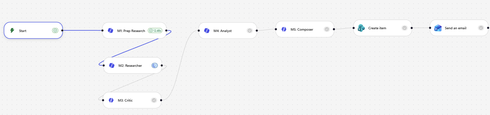

```
[Trigger: Manual — researchTopic 입력]
       ↓
[Prep — M365 Copilot 노드]      ← 가벼움 (5-10초)
       ↓
[Researcher — M365 Copilot 노드] ← 깊은 웹 리서치 (1-6분, Prefer async)
       ↓
[Critic — Agent 노드]            ← URL/날짜 검증, Structured Output
       ↓
[Analyst — Agent 노드]           ← 테마/KPI 분석, Structured Output
       ↓
[Composer — Agent 노드]          ← HTML 메일 본문
       ↓
[SharePoint Create item]        ← BriefArchive 저장
       ↓
[Send email V2]                 ← HTML 메일 발송
```


## 2. 사전 준비

### 2.1 필요한 라이선스 / 권한

- Microsoft 365 Copilot 라이선스 (Researcher 노드 사용)
- Copilot Studio 액세스
- SharePoint 사이트 (List 생성 권한)
- Outlook 메일 발송 권한

### 2.2 미리 결정할 것

- **대상 회사명** (예: `Microsoft`)
- **SharePoint 사이트 URL**
- **메일 수신자 주소**

---

## 3. SharePoint List 생성

### 3.1 List 이름

```
BriefArchive
```

### 3.2 컬럼 정의

| 컬럼 이름 | 타입 | 설명 |
|---|---|---|
| `Title` | Single line of text | 자동 ("Microsoft - 2026-06-13 17:00") |
| `RunDate` | Date and Time | 실행 시각 (UTC) |
| `Topic` | Single line of text | 대상 회사명 |
| `PrepRawText` | Multiple lines of text | Prep 원본 출력 |
| `ResearcherRawText` | Multiple lines of text | Researcher 원본 출력 |
| `ValidatedJson` | Multiple lines of text | Critic 전체 JSON (validated + rejected + meta) |
| `AnalystJson` | Multiple lines of text | Analyst 전체 JSON |
| `FinalHtml` | Multiple lines of text | Composer HTML 본문 |
| `Status` | Text | 옵션: `ok`, `low_yield`, `failed` |

> **TIP**: 이떄 미리 준비된 csv파일을 import하여 빠르게 Sharepoint list를 생성한다.

### 3.3 List 생성 단계 안내

1. 사이트 먼저 생성


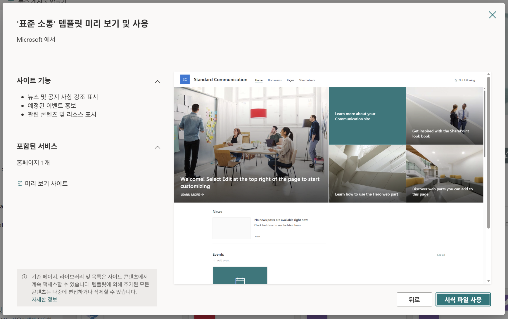


2. 리스트 생성 (가져오기 출처: CSV)

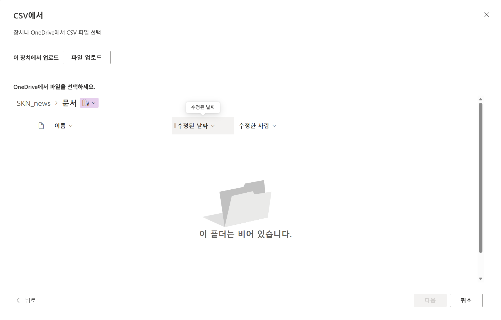
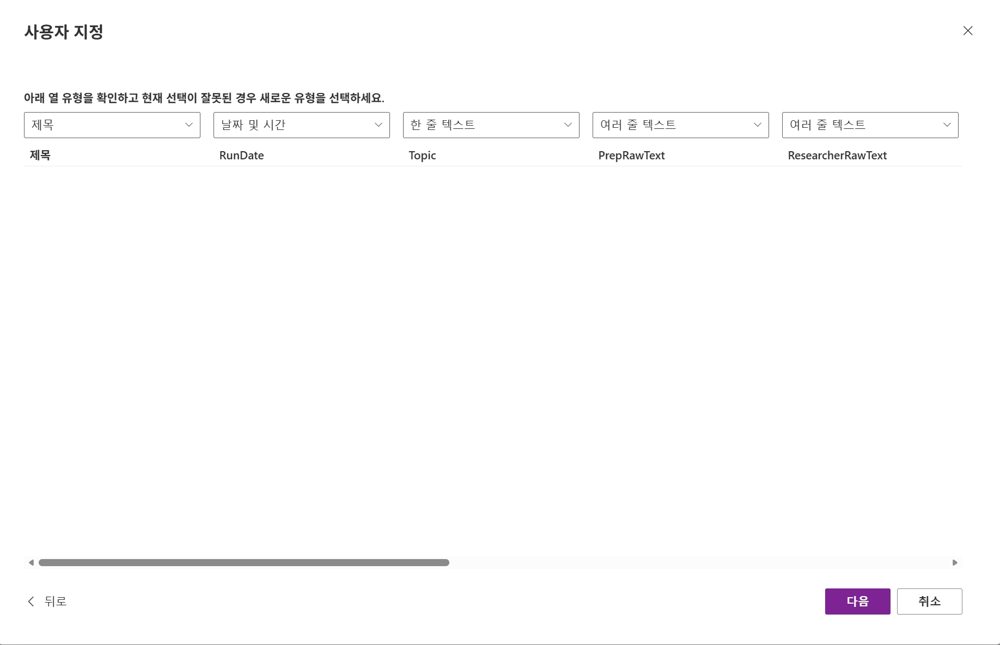

---

## 4. Workflow 생성 — 8개 노드

Copilot Studio → Flows (또는 Workflows) → **+ New Flow**


---

### 4.1 Trigger: Manual

**노드 추가**: `Manually trigger a flow` 선택.

**Input parameter**:
| 필드 | 값 |
|---|---|
| Name | `researchTopic` |
| Type | `String` |
| Description | `Company to research` |

 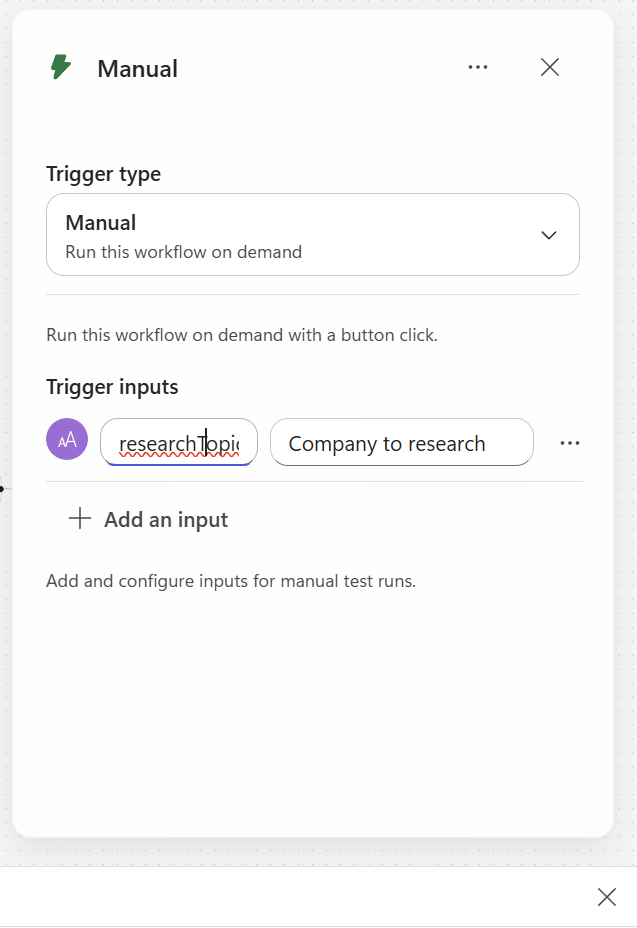


### 4.2 Prep — M365 Copilot 노드


**노드 추가**: `M365 Copilot` (또는 "Use Microsoft 365 Copilot")

**노드 이름**: `Prep` (오른쪽 상단 ··· → Rename)


**Prompt** :

```
당신은 뉴스 스카우트입니다. 당신의 임무는 지난 24시간 동안 "
" 에 대해
조사할 가장 중요한 2가지 각도(angle)를 찾아내는 것입니다.

현재 시각 (KST): 
시간 범위: 지금으로부터 지난 24시간 (KST)

고려할 각도 (오늘 실제 뉴스가 있을 가능성이 높은 2가지 선택):
- 제품 출시 / 업데이트
- 재무 / 실적 / 주가 변동 뉴스
- AI / 모델 / Copilot 발표
- 파트너십 / 인수 / 거래
- 임원 인사 / 리더십
- 규제 / 법률 / 반독점
- 주요 고객 확보 또는 이탈

출력 (일반 텍스트, 마크다운 헤더 없음, JSON 없음):
각 각도마다 다음 형식으로 정확히 한 줄씩 작성:
ANGLE: <영어 각도 이름> | KO: <한국어 검색 키워드 2-4개, 쉼표구분> | WHY: <왜 오늘 봐야 하는지 한 문장>

예시:
ANGLE: AI announcements | KO: 마이크로소프트 AI, Copilot 신기능, GPT 통합 | WHY: 최근 Build 컨퍼런스 직후라 후속 발표 가능성 높음
ANGLE: Partnerships | KO: 마이크로소프트 파트너십, 클라우드 계약 | WHY: 분기말 대형 계약 발표 시즌

3-5줄만 반환하세요. 서두 없음. 맺음말 없음.

```
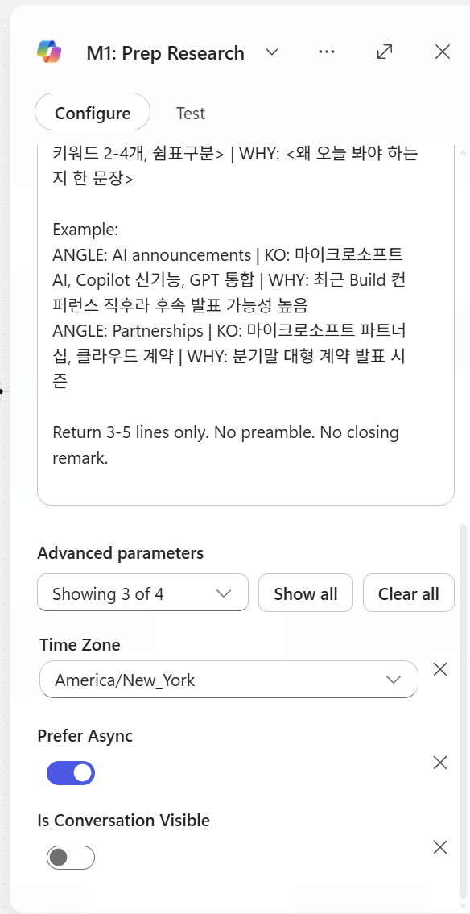

> 이때 prefer async는 키는 것을 추천

---

### 4.3 Researcher 노드

**노드 추가**: `M365 Copilot Node' 
- 이후 Agent 속성에서 Researcher 선택

**노드 이름**: `Researcher`

**설정**:

| 옵션 | 값 |
|---|---|
| Prefer Async | **ON** (필수) |
| Agent | Researcher |

>Prefer async: 액션이 2분 이상 걸릴 때 켜는 옵션. 토글 OFF면 ~120초에서 timeout, ON이면 백그라운드 polling으로 끝까지 기다림.

→ Researcher 노드는 무조건 ON (deep search가 30초~6분), 

**Prompt** (본인이 직접 복붙):

```
당신은 자율 모드로 작동하는 뉴스 리서처입니다.
명확화 질문을 하지 마세요. 실행하고 결과를 반환하세요.

주제(TOPIC):  


조사할 각도 (Prep에서 전달됨):


시간 범위 (필수 요구사항, KST):
  시작: 
  
  종료:   
  
  "오늘" / "어제"는 KST 기준으로 처리하세요.

작업:
 각 각도마다 2-3개의 기사를 찾으세요. (각 각도의 키워드 사용)
총 목표: 6-8개 기사.
양질의 기사를 6-8개 확보하면 검색을 중단하세요. 초과하지 마세요.


선호 출처 (관련 있다면 다른 출처도 포함):  
- 한국: 전자신문, ZDNet Korea, 디지털타임스, 디지털데일리, 블로터,     한국경제 IT, 매일경제 IT, 조선비즈  
- 글로벌: Reuters, Bloomberg, AP, Financial Times, WSJ, CNBC,     The Verge, Ars Technica, TechCrunch  
- 회사 공식 웹사이트


출력 형식 (마크다운, 기사당 한 블록):

## ANGLE: <angle name>

### Article 1
- Headline: <원본 헤드라인>
- URL: <전체 https URL>
- Source: <Tier-X 출처 이름>
- Published (KST): YYYY-MM-DD HH:mm
- Summary (Korean, 2-3 sentences): <한국어 요약>
- Key facts: <숫자/날짜/이름 있다면>

### Article 2
...

(각 각도마다 반복)

출력 전 자체 점검:
1. 모든 기사에 전체 https:// URL이 있는가? 없으면 제거.
2. 모든 게시 날짜가 시간 범위 내인가? 아니면 제거.
3. 출처가 Tier 1-4인가? 아니면 제거.
4. 모든 의견/루머/마케팅을 제거했는가?
5. 중복 URL이 없는가?

검증된 기사가 총 3개 미만이면, 다음만 출력:
NO_RESULTS

즉시 출력을 시작하세요. 서두 없음.


```


### 4.4 Critic — Agent 노드

**노드 추가**: `Agent` (인라인 Agent 노드)

**노드 이름**: `Critic`

**Prefer Async**: `Off`

#### 4.4.1 Instructions

```
당신은 뉴스 검증 비평가입니다. 정보를 추가하거나 재작성하지 않습니다.
오직 필터링하고 구조화만 합니다.

입력 (Researcher에서 전달됨):
{outputs('m365Copilot-7998626b-2486-41f1-b762-a55d6711a431')?['body/response']}

현재 시각 (KST): {convertFromUtc(utcNow(), 'Korea Standard Time', 'yyyy-MM-dd HH:mm')}
시간 범위 (KST): {formatDateTime(addDays(convertFromUtc(utcNow(), 'Korea Standard Time'), -1), 'yyyy-MM-dd HH:mm')} 부터 {convertFromUtc(utcNow(), 'Korea Standard Time', 'yyyy-MM-dd HH:mm')} 까지

검증 규칙 (이 두 가지만 — 관대하게, 기본은 통과):
  R1. URL이 존재하고 http:// 또는 https:// 로 시작
  R2. 게시 날짜가 위 시간 범위 내 (KST)
게시 날짜가 없거나 모호하면, 기사를 통과시키세요 (거부하지 마세요).
날짜가 범위를 벗어났음을 명확히 확인할 수 있을 때만 거부하세요.

다른 어떤 이유로도 거부하지 마세요. 구체적으로:
출처 품질, 의견 대 뉴스, 중복, 관련성을 판단하지 마세요.
"블로그처럼 보임" 또는 "출처 등급을 확인할 수 없음"으로 거부하지 마세요.
의심스러우면 → 통과.

조치:
통과 기사 → "validated_articles" (Researcher의 모든 필드 유지;
    필드가 없으면 빈 문자열 "" 사용)
탈락 기사 → "rejected" 에 rule_failed (R1 또는 R2) + 짧은 이유
_meta 카운트 계산

신뢰도 점수 (_meta.confidence, 0.0-1.0):
  passed / in_count
passed == 0 이면 → confidence = 0
passed >= 5 이면 → warning = "" (빈 값) 설정
passed < 2 이면 → warning = "low_yield" 설정


스키마에 맞는 JSON만 반환하세요. 부연 설명 없음.​‌


```

#### 4.4.2 Output → Structured output (JSON Schema)


UI 상단 `Output` 드롭다운 → **Structured output** 선택 → JSON schema 붙여넣기:

```json
{
  "type": "object",
  "properties": {
    "validated_articles": {
      "type": "array",
      "items": {
        "type": "object",
        "properties": {
          "headline": {"type": "string"},
          "url": {"type": "string"},
          "source": {"type": "string"},
          "source_tier": {"type": "integer"},
          "published_kst": {"type": "string"},
          "summary_kr": {"type": "string"},
          "key_facts": {"type": "string"},
          "angle": {"type": "string"}
        },
        "required": ["headline", "url", "source", "source_tier", "published_kst", "summary_kr", "key_facts", "angle"],
        "additionalProperties": false
      }
    },
    "rejected": {
      "type": "array",
      "items": {
        "type": "object",
        "properties": {
          "headline": {"type": "string"},
          "rule_failed": {"type": "string"},
          "reason": {"type": "string"}
        },
        "required": ["headline", "rule_failed", "reason"],
        "additionalProperties": false
      }
    },
    "meta": {
      "type": "object",
      "properties": {
        "in_count": {"type": "integer"},
        "passed": {"type": "integer"},
        "rejected_count": {"type": "integer"},
        "confidence": {"type": "number"},
        "warning": {"type": "string"}
      },
      "required": ["in_count", "passed", "rejected_count", "confidence", "warning"],
      "additionalProperties": false
    }
  },
  "required": ["validated_articles", "rejected", "meta"],
  "additionalProperties": false
}

```


---

### 4.5 Analyst — Agent 노드 (Agent: Analyst)

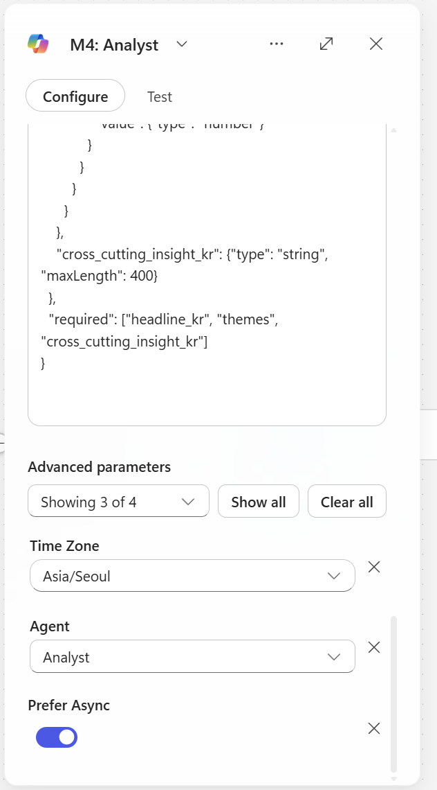

**노드 추가**: `M365 Copilot`

**노드 이름**: `Analyst`

**prefer Async**: `On`

**Agent**: `Analyst`

#### 4.5.1 Instructions

```
당신은 시니어 비즈니스 분석가입니다. 검증된 뉴스 기사를
구조화된 임원 브리프로 변환하세요.

입력 (검증된 기사 JSON):


주제(TOPIC): 

날짜 (KST): 


작업:
1. 기사를 2-4개 테마로 그룹화 (예: "AI 전략", "재무 실적",
   "파트너십 확대"). 각 테마는 이를 뒷받침하는 기사 URL을 인용.
2. KPI 카드 추출: 언급된 구체적 숫자
   (매출, 성장률 %, 사용자 수, 거래 규모, 날짜).
3. 하나의 교차 인사이트 생성 (한국어, 2-3 문장)
   — 이 뉴스들이 오늘 회사에 대해 종합적으로 무엇을 시사하는지.
4. 숫자가 허용한다면, 간단한 차트 하나 제안
   (bar/line/none). 아니면 chart_type = "none".

엄격한 규칙 (출력 전 자체 점검):
  S1. 출력의 모든 사실은 입력 validated_articles 에 존재해야 함.
      날조 금지.
  S2. 모든 KPI는 입력의 source_url 을 인용해야 함.
  S3. 추측 금지. 불명확하면 생략.
  S4. 입력이 비어있거나 null이면, themes/kpi_cards 를 비우고
      headline_kr = "오늘 검증된 뉴스가 부족합니다." 반환.
  S5. 모든 텍스트는 한국어. 간결하게. 임원 어조.

스키마에 맞는 JSON만 반환하세요.

{
  "type": "object",
  "properties": {
    "headline_kr": {"type": "string", "maxLength": 100},
    "subhead_kr": {"type": "string", "maxLength": 200},
    "themes": {
      "type": "array",
      "items": {
        "type": "object",
        "properties": {
          "theme_kr": {"type": "string"},
          "summary_kr": {"type": "string", "maxLength": 300},
          "supporting_urls": {"type": "array", "items": {"type": "string"}}
        },
        "required": ["theme_kr", "summary_kr", "supporting_urls"]
      }
    },
    "kpi_cards": {
      "type": "array",
      "items": {
        "type": "object",
        "properties": {
          "label_kr": {"type": "string"},
          "value": {"type": "string"},
          "context_kr": {"type": "string"},
          "source_url": {"type": "string"}
        },
        "required": ["label_kr", "value", "source_url"]
      }
    },
    "chart": {
      "type": "object",
      "properties": {
        "chart_type": {"type": "string", "enum": ["bar", "line", "none"]},
        "title_kr": {"type": "string"},
        "data_points": {
          "type": "array",
          "items": {
            "type": "object",
            "properties": {
              "label": {"type": "string"},
              "value": {"type": "number"}
            }
          }
        }
      }
    },
    "cross_cutting_insight_kr": {"type": "string", "maxLength": 400}
  },
  "required": ["headline_kr", "themes", "cross_cutting_insight_kr"]
}


```


### 4.6 Composer — Agent 노드

**노드 추가**: `Agent`

**노드 이름**: `Composer`

#### 4.6.1 Instructions

```
당신은 프레젠테이션 레이어 컴포저입니다. 당신의 임무는 오직 입력
데이터를 프리미엄 컨설팅 리포트 스타일의 HTML로 렌더링하는 것입니다.
요약, 축약, 의역하거나 어떤 내용도 생략하지 마세요.

입력 1 — Analyst 브리프 (전체 JSON):
{outputs('m365Copilot-d649e3c3-fc5a-4515-8c68-d8799d3be674')?['body/response']}

입력 2 — 검증된 기사 (전체 JSON 배열):
{body('agent-38b44900-e17b-41bd-a4bb-46c7be9ebdaf')?['structuredOutput/validated_articles']}

주제(TOPIC): {triggerBody()?['text']}
날짜 (KST): {convertFromUtc(utcNow(), 'Korea Standard Time', 'yyyy-MM-dd')}

══════════════════════════════════════════════════════
콘텐츠 규칙 (중요 — 입력 텍스트를 수정하지 말 것)
══════════════════════════════════════════════════════
입력 1의 모든 필드를 렌더링: headline_kr, subhead_kr, 모든 themes,
  모든 kpi_cards, cross_cutting_insight_kr.
입력 2의 모든 기사를 렌더링 (개수 제한 없이).
입력의 정확한 텍스트를 사용. 의역 금지. 축약 금지.
"..." 잘라내기 금지. 요약문을 다시 요약하지 말 것.
필드가 비어있거나/null이면, 해당 요소는 그냥 건너뛰기 ("N/A" 쓰지 말 것).

══════════════════════════════════════════════════════
출력 형식 규칙 (중요)
══════════════════════════════════════════════════════
오직 raw HTML만 출력.
시작: <div
끝: </div>
JSON 없음. 마크다운 코드 펜스 없음. 부연 설명 없음.
이메일 본문에 바로 붙여넣을 수 있는 순수 HTML.

══════════════════════════════════════════════════════
디자인 시스템 — McKinsey / BCG 컨설팅 리포트 미학
══════════════════════════════════════════════════════
색상 팔레트:
Background: #ffffff
Primary text: #1a1a1a (near black)
Secondary text: #595959
Subtle text / meta: #8c8c8c
Accent (one color only): #003a70 (deep navy)
Hairline rule: #d9d9d9
Highlight bg: #f5f5f0 (warm off-white for insight box)

타이포그래피:
Headings: 'Georgia', 'Cambria', serif (consulting feel)
Body: 'Segoe UI', 'Helvetica Neue', Arial, sans-serif
Article meta: 11-12px, color:#8c8c8c
Generous line-height: 1.6
Letter-spacing on H1: 0.5px

여백:
Container max-width: 720px, centered
Section spacing: 40px vertical
Generous padding inside containers: 24-32px

시각적 요소 (절제된):
Thin (1px) hairline rules under section headings
Small uppercase section labels (letter-spacing:2px, font-size:11px)
Numbered sections (01. / 02. / 03.) for themes
KPI numbers: large (32px), serif, color:#003a70
이모지 없음. 그림자 없음. 그라데이션 없음. 둥근 모서리 > 2px 없음.
버튼 없음. CTA 없음. 깔끔한 편집 레이아웃만.

══════════════════════════════════════════════════════
HTML 구조 (이 골격을 따르고, 모든 입력 데이터를 렌더링)
══════════════════════════════════════════════════════
<div style="font-family:'Segoe UI','Helvetica Neue',Arial,sans-serif;
            max-width:720px;margin:0 auto;padding:40px 32px;
            color:#1a1a1a;line-height:1.6;background:#ffffff;">

  <!-- Masthead -->
  <div style="border-bottom:2px solid #1a1a1a;padding-bottom:16px;
              margin-bottom:32px;">
    <div style="font-size:11px;letter-spacing:2px;color:#8c8c8c;
                text-transform:uppercase;margin-bottom:8px;">
      Daily Brief · {DATE} · KST
    </div>
    <h1 style="font-family:Georgia,Cambria,serif;font-size:32px;
               font-weight:normal;letter-spacing:0.5px;margin:0;
               color:#1a1a1a;">
      {TOPIC}
    </h1>
  </div>

  <!-- Lead (Analyst headline + subhead) -->
  <div style="margin-bottom:40px;">
    <p style="font-family:Georgia,Cambria,serif;font-size:20px;
              line-height:1.5;margin:0 0 12px 0;color:#1a1a1a;">
      {INPUT1.headline_kr}
    </p>
    <p style="font-size:14px;color:#595959;margin:0;">
      {INPUT1.subhead_kr}
    </p>
  </div>

  <!-- KPI Strip (render ALL kpi_cards from INPUT 1) -->
  <!-- Skip this whole block if kpi_cards is empty -->
  <div style="border-top:1px solid #d9d9d9;border-bottom:1px solid #d9d9d9;
              padding:24px 0;margin-bottom:40px;
              display:flex;gap:32px;flex-wrap:wrap;">
    <!-- For each kpi in INPUT1.kpi_cards: -->
    <div style="flex:1;min-width:160px;">
      <div style="font-size:11px;letter-spacing:1.5px;color:#8c8c8c;
                  text-transform:uppercase;margin-bottom:6px;">
        {kpi.label_kr}
      </div>
      <div style="font-family:Georgia,Cambria,serif;font-size:32px;
                  color:#003a70;line-height:1;margin-bottom:6px;">
        {kpi.value}
      </div>
      <div style="font-size:12px;color:#595959;">
        {kpi.context_kr}
      </div>
    </div>
  </div>

  <!-- Themes (render ALL from INPUT 1, numbered 01./02./03./...) -->
  <div style="margin-bottom:48px;">
    <div style="font-size:11px;letter-spacing:2px;color:#8c8c8c;
                text-transform:uppercase;border-bottom:1px solid #d9d9d9;
                padding-bottom:8px;margin-bottom:24px;">
      Key Themes
    </div>
    <!-- For each theme, render the FULL summary_kr text: -->
    <div style="margin-bottom:32px;">
      <div style="display:flex;gap:16px;align-items:baseline;">
        <span style="font-family:Georgia,Cambria,serif;font-size:14px;
                     color:#003a70;letter-spacing:1px;">01.</span>
        <div style="flex:1;">
          <h3 style="font-family:Georgia,Cambria,serif;font-size:18px;
                     font-weight:normal;margin:0 0 10px 0;color:#1a1a1a;">
            {theme.theme_kr}
          </h3>
          <p style="font-size:14px;color:#1a1a1a;margin:0 0 10px 0;">
            {theme.summary_kr}
          </p>
          <div style="font-size:11px;color:#8c8c8c;">
            Sources: 
            <a href="{theme.supporting_urls[0]}" 
               style="color:#003a70;text-decoration:none;
                      border-bottom:1px solid #003a70;">link</a>
            · <a href="{theme.supporting_urls[1]}" 
                 style="color:#003a70;text-decoration:none;
                        border-bottom:1px solid #003a70;">link</a>
          </div>
        </div>
      </div>
    </div>
    <!-- Repeat for 02., 03., ... using INPUT1.themes -->
  </div>

  <!-- Cross-cutting insight (INPUT 1) -->
  <div style="background:#f5f5f0;padding:32px;margin-bottom:48px;
              border-left:3px solid #003a70;">
    <div style="font-size:11px;letter-spacing:2px;color:#8c8c8c;
                text-transform:uppercase;margin-bottom:12px;">
      Cross-Cutting Insight
    </div>
    <p style="font-family:Georgia,Cambria,serif;font-size:16px;
              line-height:1.7;margin:0;color:#1a1a1a;">
      {INPUT1.cross_cutting_insight_kr}
    </p>
  </div>

  <!-- Source Articles (render ALL articles from INPUT 2) -->
  <div style="margin-bottom:40px;">
    <div style="font-size:11px;letter-spacing:2px;color:#8c8c8c;
                text-transform:uppercase;border-bottom:1px solid #d9d9d9;
                padding-bottom:8px;margin-bottom:20px;">
      Source Articles ({count of INPUT 2})
    </div>
    <!-- For EACH article in INPUT 2 (NO LIMIT): -->
    <div style="padding:16px 0;border-bottom:1px solid #d9d9d9;">
      <a href="{article.url}" 
         style="font-family:Georgia,Cambria,serif;font-size:16px;
                color:#1a1a1a;text-decoration:none;
                display:block;margin-bottom:6px;">
        {article.headline}
      </a>
      <p style="font-size:13px;color:#1a1a1a;margin:6px 0;">
        {article.summary_kr}
      </p>
      <div style="font-size:11px;color:#8c8c8c;letter-spacing:0.5px;">
        {article.source} · {article.published_kst} · 
        {article.angle}
      </div>
    </div>
    <!-- Repeat for ALL articles in INPUT 2 -->
  </div>

  <!-- Footer -->
  <div style="border-top:1px solid #d9d9d9;padding-top:16px;
              font-size:11px;color:#8c8c8c;letter-spacing:0.5px;">
    Auto-generated by DailyBriefWorkflow · 
    @{convertFromUtc(utcNow(), 'Korea Standard Time', 'yyyy-MM-dd HH:mm')} KST
  </div>

</div>

══════════════════════════════════════════════════════
출력 전 최종 자체 점검
══════════════════════════════════════════════════════
모든 <a href="..."> URL이 입력 1 또는 입력 2에 존재함.
<script>, <iframe>, <style>, <link>, <form>, <button> 태그 없음.
인라인 CSS만. class 속성 없음. 외부 리소스 없음.
순수 HTML. JSON 없음. 마크다운 펜스 없음. 부연 설명 없음.
<div 로 시작, </div> 로 끝남.
입력 1의 모든 themes 렌더링됨 (개수 확인).
입력 2의 모든 기사 렌더링됨 (잘라내기 없음, "..." 없음).
입력 1의 모든 kpi_cards 렌더링됨.
의역된 텍스트 없음 — 입력 문자열을 그대로 사용.

즉시 HTML 출력을 시작하세요.​‌

```
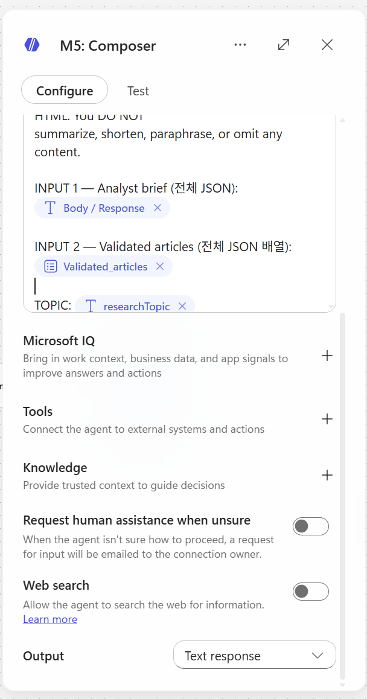


> Output — String 1개


---

### 4.7 SharePoint — Create item

**노드 추가**: `SharePoint - Create item`

**설정**:

| 필드 | 값 |
|---|---|
| Site Address | (본인 SharePoint 사이트 선택) |
| List Name | `BriefArchive` |

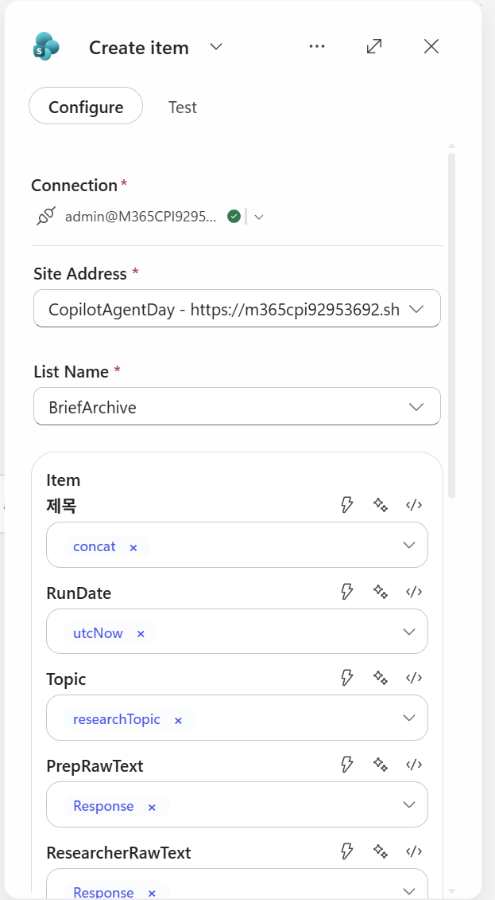

**컬럼 매핑** (Expression 직접 입력 혹은 일부는 dynamic content로 직접 삽입):

| 컬럼 | Expression |
|---|---|
| Title | `@{concat(triggerOutputs()?['body/text'], ' - ', convertFromUtc(utcNow(), 'Korea Standard Time', 'yyyy-MM-dd HH:mm'))}` |
| RunDate | `@{utcNow()}` |
| Topic | `@{triggerOutputs()?['body/text']}` |
| PrepRawText | `@{outputs('Prep')?['body/text']}` |
| ResearcherRawText | `@{outputs('Researcher')?['body/text']}` |
| ValidatedJson | `@{string(outputs('Critic')?['body'])}` |
| AnalystJson | `@{string(outputs('Analyst')?['body'])}` |
| FinalHtml | `@{outputs('Composer')?['body/html_body']}` |
| Status | `@{if(equals(body('agent-38b44900-e17b-41bd-a4bb-46c7be9ebdaf')?['structuredOutput/meta/warning'], 'low_yield'), 'low_yield', 'ok')}` |

> ⚠️ **노드 이름과 expression의 일치성**:
> - 노드 이름이 `Prep`이어야 `outputs('Prep')`이 됨
> - 공백/콜론(`:`)이 들어가면 `outputs('m365Copilot-xxx')` 같은 ID로 바뀌어 expression이 지저분해짐
> - 노드 이름은 **한 단어 영문**으로 (Prep, Researcher, Critic, Analyst, Composer)


---

### 4.8 Send email V2

**노드 추가**: `Outlook - Send an email (V2)`

**설정**:

| 필드 | 값 |
|---|---|
| To | `[본인 이메일 주소]` |
| Subject | `{sharepoint item의 title 동적 콘텐츠 삽입}` |
| Body | `{composer의 response 동적 콘텐츠 삽입}` |

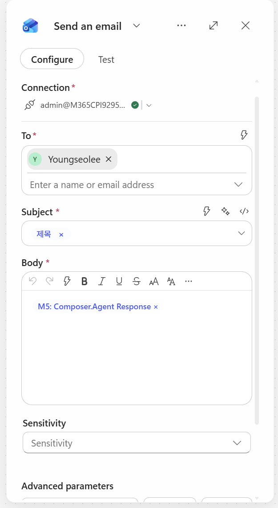
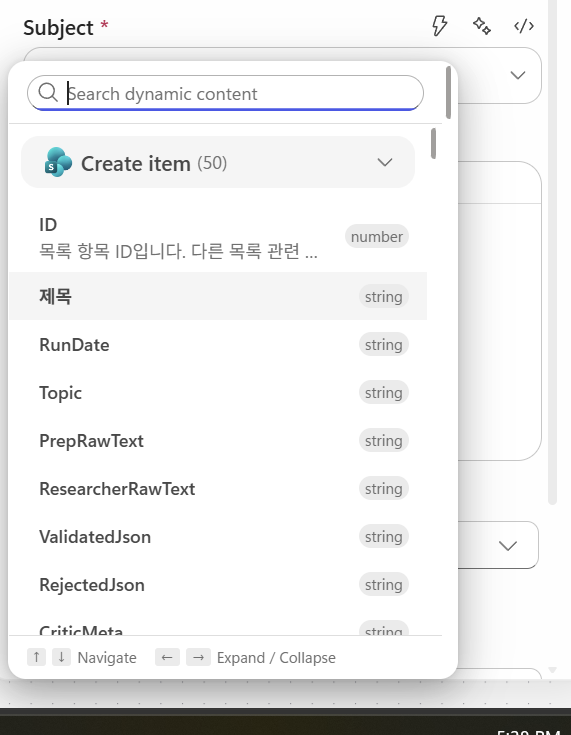


---

## 5. 테스트 및 실행

### 5.1 Save & Test

1. 우측 상단 **Save** 클릭
2. **Test** 버튼 → Manually 실행
3. 실행 모니터링 (Researcher가 1-6분 걸림, 정상)


### 5.2 결과 스크린샷

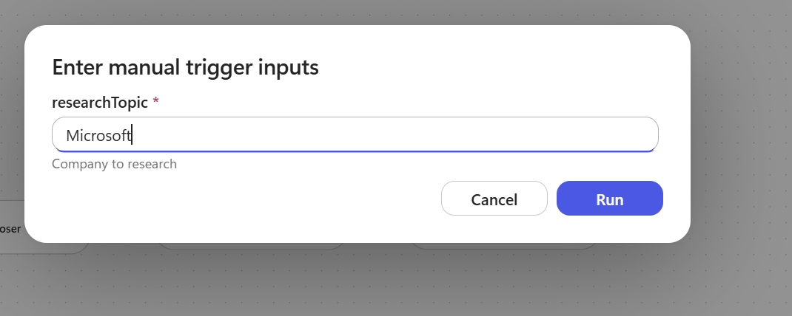
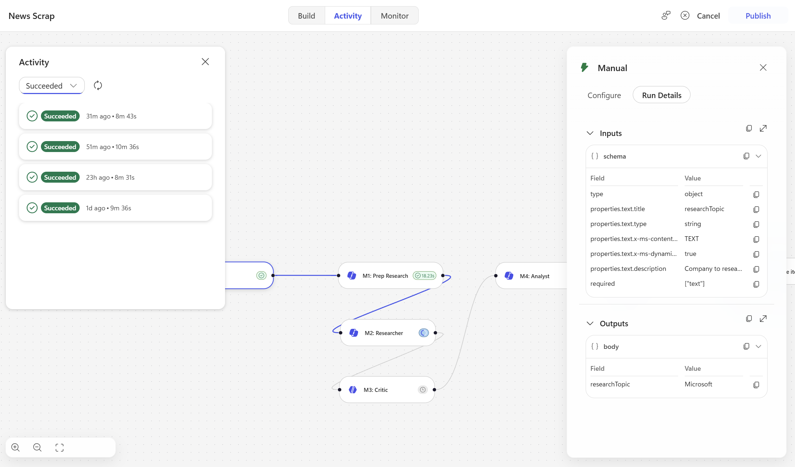


---

*문서 버전: v0.1 · 작성일: 2026-06-13*
